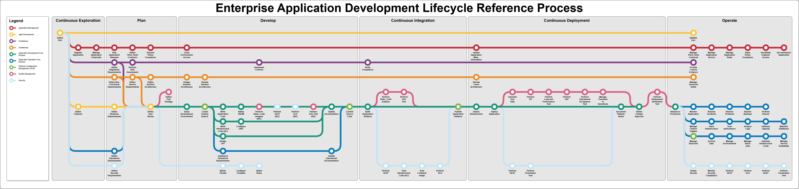

# enterprise-application-delivery-lifecycle-process

 

A collection of diagramming tools to help create an enterprise application delivery lifecycle process and corresponding platform engineering capabilities 

## Overview

This project is inspired by (https://github.com/djschleen/devsecops-architecture-tools) which shows how a DevSecOps Architecture could look like. However it looked a little bit unstructured and chaotic with too many dimensions in one diagram. It also left out a lot of enterprise, application management and application operations aspects.

So the main goal of this project was:
- Generate the Enterprise Application Delivery Lifecycle Process diagram from a meta model

Next steps to enhance the generator are
- Generate Markdown documentation for each activities
- Add products to the diagram

## Tools and Content

This repository contains the following tools and content:

| Content | Location | Description |
|---|---|---|
| Draw.io library | [drawio](drawio) | You can find the Python programs to generate the Draw.io process diagrams |
| Meta-Model | [meta_model](meta_model) | You can a simple meta-model here that you could tailor to your needs |
| Sample Diagram | [sample/diagram](sample/diagram/) | You can find a full fledge sample of a generated Draw.io diagram |
| Sample Meta Model| [sample/meta_model](sample/meta_model/) | You can find a full fledge sample meta-model used to generate the sample diagram |

## Using the Draw.io library

### Get draw.io
[diagrams.net](https://diagrams.net) (previously draw.io) is a free and open source cross-platform graph drawing software developed in HTML5 and JavaScript. Its interface can be used to create diagrams such as flowcharts, wireframes, UML diagrams, organizational charts, and network diagrams. You can download an entire working copy from the website, or from [github.com](https://github.com/jgraph/drawio-desktop). It's also available as a snap if you are using Ubuntu.

### Define the Meta-Model of your Enterprise Application Delivery Lifecycle Process
Use the sample_enterprise_application_delivery_lifecycle_process.yaml and tailor it to your enterprise

### Generate your Enterprise Application Delivery Lifecycle Process diagram
Use the Python program generate_process_diagram.py to generate your Enterprise Application Delivery Lifecycle Process diagram

`py drawio/generate_process_diagram.py -i .\sample\meta_model\sample_enterprise_application_delivery_lifecycle_process.yaml -o .\sample\diagram\sample-enterprise-application-delivery-lifecycle-process.drawio`

## Sample Enterprise Application Delivery Lifecycle Process

This is an example of a Enterprise Application Delivery Lifecycle Process

